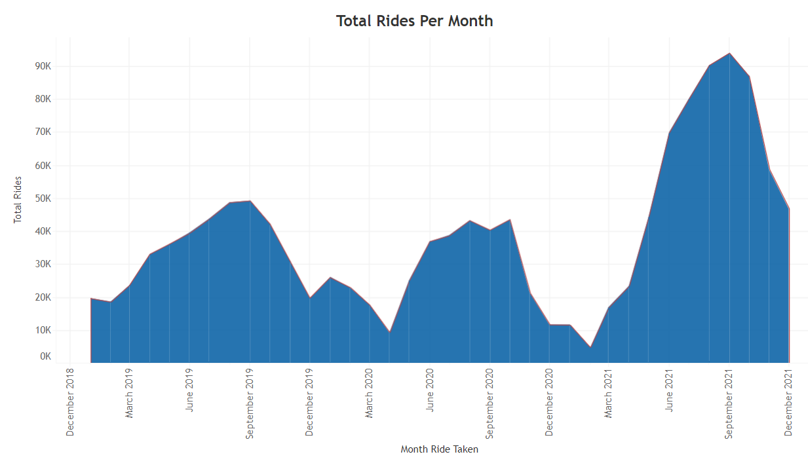
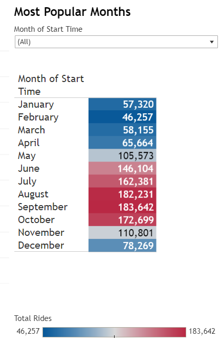
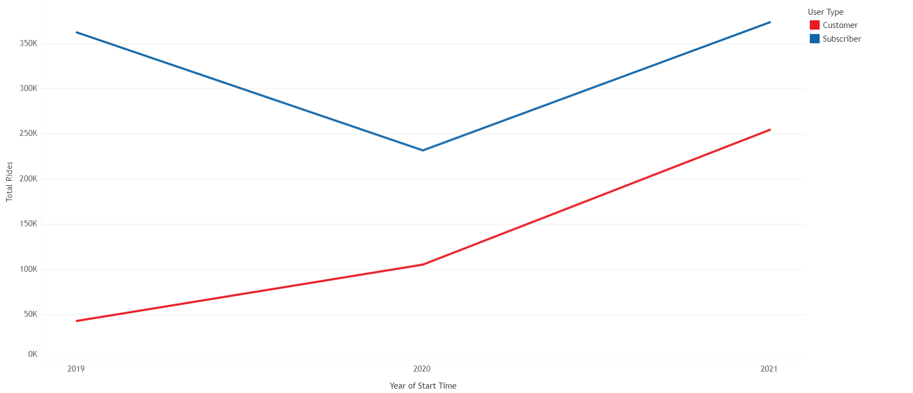
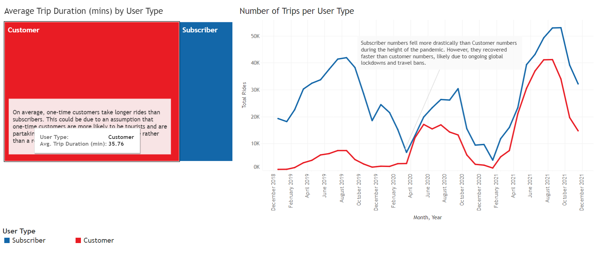
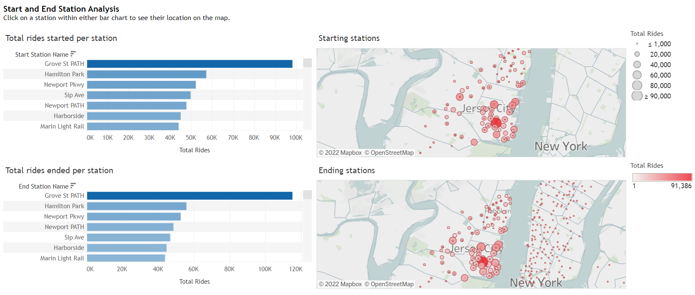
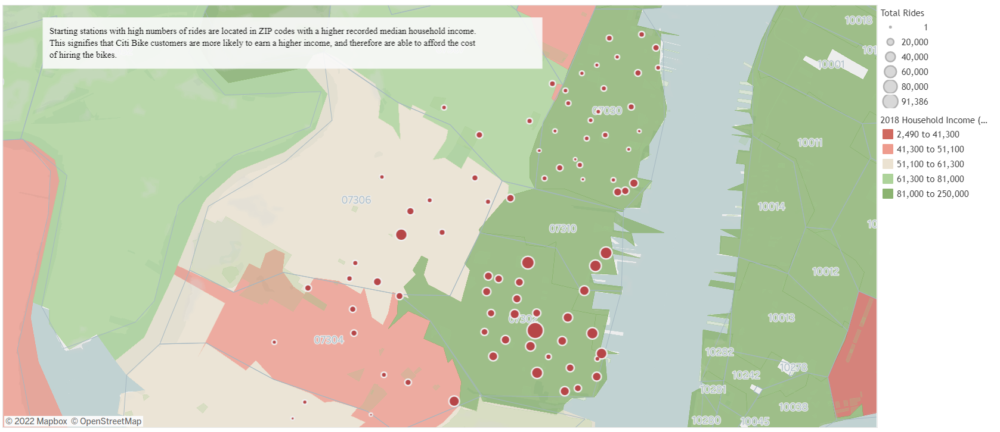
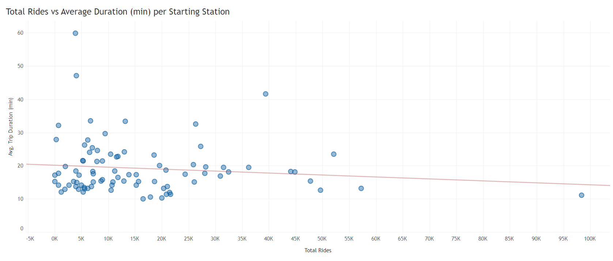
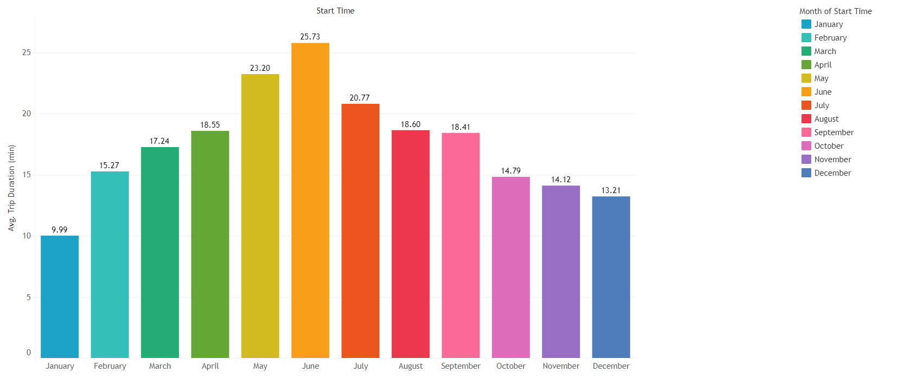
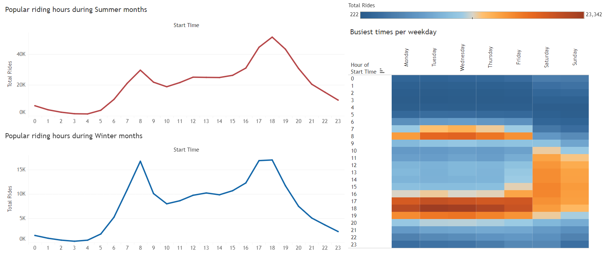

# Tableau Challenge - Citi Bike Analysis

## Background

Congratulations on your new job! As the new lead analyst for the [New York Citi Bike](https://en.wikipedia.org/wiki/Citi_Bike) Program, you are now responsible for overseeing the largest bike sharing program in the United States. In your new role, you will be expected to generate regular reports for city officials looking to publicise and improve the city program.

Since 2013, the Citi Bike Program has implemented a robust infrastructure for collecting data on the program's utilisation. Through the team's efforts, each month bike data is collected, organised, and made public on the [Citi Bike Data](https://www.citibikenyc.com/system-data) webpage.

However, while the data has been regularly updated, the team has yet to implement a dashboard or sophisticated reporting process. City officials have a number of questions on the program, so your first task on the job is to build a set of data reports to provide the answers.

## Task

My task in this assignment was to aggregate data found in the [Citi Bike Trip History Logs](https://ride.citibikenyc.com/system-data) and find some unexpected phenomena.

## Submission

My final submission includes:

* A [link to my Tableau Public workbook](https://public.tableau.com/views/CitiBikeAnalysis_16568299440390/Story1?:language=en-US&publish=yes&:display_count=n&:origin=viz_share_link) that includes:

  * A main story depicting multiple dashboards and visualisations, with a concise summary of each phenomena discovered.

* The [tableau packaged workbook]("Ciki Bike Analysis.tbwx")
* A text or markdown file with my analysis on the phenomenons you uncovered from the data.
* All the [raw data](raw_data) downloaded from the Citi Bike System Data
* The [python scrips](jupyter_notebooks) used to clean and merge the datasets
* The [final dataset](cleaned_data/all_data.csv) I used for my analysis

## Analysis and Findings
For this analysis, I decided to use all recorded bike data from 2019 - 2021, as a way to uncover more recent ride trends, as well as any trends observed before, during, and after the COVID-19 pandemic. 

* I first downloaded and cleaned all `.csv` data downloaded from the Citi Bike System Data website and merged all data together (total rides > 1.36mil)

* I then began analysing the data using Tableau, and created the following visualisations:

    * 2020 saw total rides decrease due to the COVID-19 pandemic, with a steep drop in ridership in April 2020 which coincides with global lockdowns and travel bans. However, as tourism has increase and lockdowns have ended, 2021 saw a sharp increase in ridership, even surpassing average ridership from 2019.
    

    * The most popular months for riders were the summer months (June, July, August). In the USA, summer months also correspond with school and university holiday periods, which could be an explanation for the increase in rides taken. As the weather is also warmer, commuters are more likely to take more active forms of transport such as bike riding.
    

    * During the pandemic, the total number of subscribers sharply decreased whilst casual customers increased at a steady rate. Even post-2020, subscribers numbers increased but not too much higher than 2019 numbers.
    

    * Overall, subscribers take more rides than customers, but customers take longer trips on average. This could be due to an assumption that one-time customers are more likely to be riding for leisure rather than for commuting purposes.
    

    * The most popular start and end stations are all located in Jersey City, with the number one station being **Grove Street PATH** station, which is located at a busy train station.
    

    * Starting stations with high numbers of rides are located in ZIP codes with a higher recorded median household income. This correlation could signify that Citi Bike customers are more likely to earn a higher income and can afford to hire the bikes. However, looking at the map, high income areas also correlate to major city centres (i.e. Hoboken and Jersey City), where higher income earners are more likely to live.
    

    * There was no strong correlation between starting station popularity and ride duration. In the graph, you can see that the most popular station did not necessarily have the longest average ride duration.
    

    * Summer months are not only the most popular for Citi Bike riders, they are also the months where users take the longest rides on average. This is could likely be due to consumers taking more rides for leisure rather than for commuting purposes.
    

    * Overall, there was no discernible difference between popular times for riders during winter and summer months. Weekday peak times were consistently 8am and 6pm, coinciding when people would be going to, and leaving from work. Weekend peak times were more stretched out during the middle of the day.
    

## Assessment

My final product was be assessed on the following metrics:

* Analytic Rigour

* Readability

* Visual Attraction

### Copyright

© 2021 Trilogy Education Services, LLC, a 2U, Inc. brand. Confidential and Proprietary. All Rights Reserved.